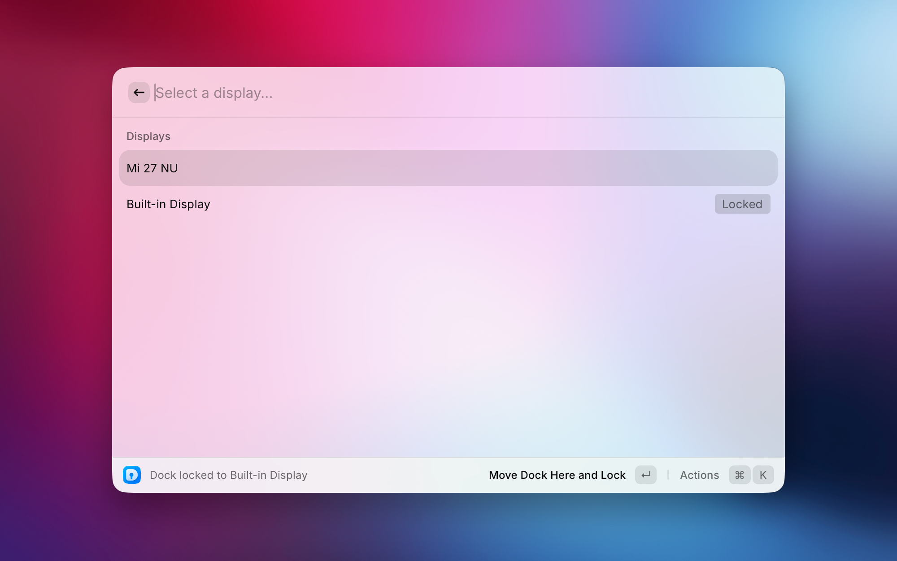

<p align="center">
  
</p>

<h1 align="center">Lockdock</h1>

<p align="center">
  Lock the macOS Dock to a specific display from Raycast.
  <br />
  A Raycast extension for <a href="https://github.com/mishamyrt/lockdock">Lockdock</a>, the macOS Dock locker.
</p>



## Prerequisites

Lockdock must be installed and enabled on your system:

```sh
brew install mishamyrt/tap/lockdock
lockdock enable
```

> ☝️ The daemon requires Accessibility permission to manage the Dock's position.

The first time you lock a position, a message will appear requesting Accessibility permission for the Lockdock app.
Make sure you grant this permission, as the app won't work without it.

## Usage

Run the **Pin Dock** command in Raycast and choose a display to move and lock the Dock there.
If the selected display is already locked, activating it again unlocks Dock placement.

## License

[MIT](LICENSE) © Mikhael Khrustik
